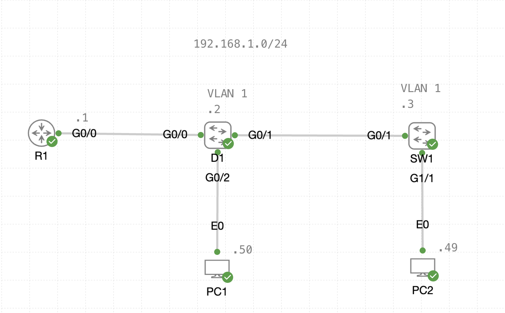

# AAA Lab

## Lab Introduction
In this lab, you'll practice enabling and confirming local line authentication, local user authentication, and AAA. Additionally, you'll be asked to use different encryption standards and judge their efficacy. Lastly, this lab includes a refresher on enabling SSH. Use this lab in preparation for:

#### Exam Topics
> 5.1 Configure and verify device access control
>
> - 5.1.a Lines and local user authentication
>
> - 5.1.b Authentication and authorization using AAA

*Please note that this lab currently does not include configuring a AAA model using RADIUS/TACACS+ configuration. Will work on it eventually...* 

#### Lab Topology


#### Lab Devices
| Device | Image | Connectivity | Notes |
| ----------- | ----------- | ----------- | ----------- | 
| R1 | IOSv | **G0/0:** 192.168.1.1 | |
| D1 | IOSvL2 | **VLAN 1:** 192.168.1.2 | |
| SW1 | IOSvL2 | **VLAN 2:** 192.168.1.3 | |
| PC1| Desktop (Alpine Linux) | **E0:** 192.168.1.50 | **User:** cisco  **Pass:** cisco |
| PC2 | Desktop (Alpine Linux) | **E0:** 192.168.1.49 | **User:** cisco **Pass:** cisco |

## Preliminary Questions
Before beginning the lab, take some time to think about these questions:
- Briefly describe the concept of AAA.
- What are the advantages of AAA over local line/user access control?
- What additional devices are needed for AAA? How do they communicate?
- What are the default IOS XE privilege levels?
- What considerations should be made when selecting password encryptions standards?

## Lab Instructions
Ensure all devices in the topology are booted before continuing. 
Verify network connectivity by using **R1** to ping **PC1** and **PC2**.

### Step 1: Configure, Verify, and Qualify Local User Password Protection
In this step, we'll practice configuring passwords of different encryption types for various lines on the device. All configuration will be done on R1.
> #### NOTE
> 
> Do not save the running config to the startup config, unless you've thoroughly tested the passwords! Basically, don't lock yourself out!

#### 1.1 Configure a console line password
- [ ] Set the password to cisco123.
- [ ] Store the password without encryption.
- [ ] Ensure the password is enforced on console login.

#### 1.2 Verify console line login
- [ ] Logout of the console. Attempt to re-enter the console with the configured password.
- [ ] Check the running config., how is the password saved? Are we happy with this?

#### 1.3 Encrypt all plain text passwords
- [ ] Use one command to obscure all clear-text passwords.
- [ ] Re-check the running config., what happened to the console password we created?
- [ ] What type of encryption are we using?
- [ ] Copy the encrypted password and enter it into this [website](https://packetlife.net/toolbox/type7/).
- [ ] Evaluate the efficacy of the encryption you performed.

#### 1.4 Create a local user account
- [ ] Configure a local user named **ADMIN** with Type 5 encrypted password **cisco123**.
- [ ] Set the console to use the newly created local user. What happens to our old password?

#### 1.5 Verify a local user account
- [ ] Logout of the console. Attempt to enter the console with the new user account.
- [ ] Examine the running config., what does the local user we created look like?
- [ ] Copy the encrypted password and enter it into this [webiste](https://www.ifm.net.nz/cookbooks/cisco-ios-enable-secret-password-cracker.html).
- [ ] Evaluate the efficacy of the encryption you performed.

#### 1.6 Enhance security with stronger encryption
- [ ] Create a new privileged Exec mode password, **cisco123** with Type 8 encryption.
- [ ] Reconfigure the ADMIN local user from Step 1.5 to use Type 9 encryption.

#### 1.7 Verify security enhancements
- [ ] Logout of the console. Attempt to login to the console and enter privileged Exec mode using the configured password.
- [ ] Examine the running config., what does the local user and enable password we created look like?
- [ ] Take a moment to scan the [NSAs Cisco Password Best Practices guide](https://media.defense.gov/2022/Feb/17/2002940795/-1/-1/1/CSI_CISCO_PASSWORD_TYPES_BEST_PRACTICES_20220217.PDF).
- [ ] Evaluate the efficacy of the encryption you performed. 

### Step 2: Terminal Line Protetection and Remote Access
In this step, we'll configure SSH on R1 and secure the VTY lines using the local user database created in the previous step.

2.1 Configure SSH support
- [ ] Set the domain name to **CISCO**.
- [ ] Generate a crypto key with a size of 4096. Why does the size of the key matter?
- [ ] What version(s) of SSH are enabled by default? Restrict the device to only support SSHv2.
- [ ] Configure SSH such that the authentication time-out is only 60 seconds or less and a max of 2 attempts is allowed.
        
*Make sure to remember the pre-requisites for enabling SSH.*

2.2 Configure the VTY Lines (0-15)
- [ ] Configure all VTY lines to only accept SSH (disable Telnet).
- [ ] Ensure the local database is queried when remotely accessing the device. 
- [ ] Ensure the system disconnects after 3 minutes of inactivity.
- [ ] Ensure the system disconnects after 15 minutes regardless of activity.

2.3 Verify SSH operation
- [ ] Test the configuration by attempting to SSH from PC1 to R1. 
> There seems to be some issues with the crypto keys so please use this commmand: 
> 
> ```ssh -oHostKeyAlgorithms=+ssh-rsa -oKexAlgorithms=+diffie-hellman-group-exchange-sha1 -l admin 192.168.1.1```
- [ ] Issue the ```show ssh``` command to examine the established sessions on R1.
   
  
### Step 3: Create a new AAA Model
In this step, we'll create and enable a AAA model using the local database for authentication.
Feel free to follow these steps while connected to R1 via SSH or directly on its console.

3.1 Enable AAA for login
- [ ] Create a new AAA model.
- [ ] Ensure the method is applied to ALL possible login vectors (console, VTY, etc.).
- [ ] Use the default method list with the enable password from Step 1.5 as Method 1.
- [ ] Verify configuration by exiting and re-entering the console.

3.3 Create a named method list for remote access login
- [ ] Name the method list VTY-AUTH.
- [ ] Use only the local user database for authentication.
- [ ] Apply the method list to the vty lines (0 - 15).

3.4 Verify AAA operation
- [ ] Attempt to SSH from PC1 to R1.

### Step 4: Examine a AAA Model
Make sure you spend some time examining AAA models using RADIUS/TACACS+ groups! 
They are a bit more complicated, so its good to read through examples.
