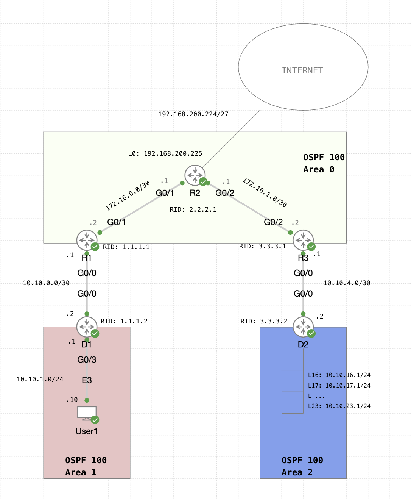

# Multi-area OSPF Lab

## Lab Introduction
In this lab, you'll practice configuring, examining, and troubleshooting multi-area OSPFv2.
One side of the network requires implementing OSPFv2 from scratch.
The other side of the network requires identifying and fixing broken OSPFv2 connections.
Additionally, this lab includes route summarization.

#### Exam Topics
> 3.2 Layer 3
>
> - 3.2.b Configure simple OSPFv2/v3 environments, including multiple normal areas, summarization, and filtering (neighbor adjacency, point-to-point, and broadcast network types, and passive-interface)

#### Lab Topology


#### Lab Devices
| Device | Image | Connectivity | Notes |
| ----------- | ----------- | ----------- | ----------- | 
| D1 | IOSv | **G0/0:** 10.10.0.2 <br> **G0/3:** 10.10.1.1 | **Router ID:** 1.1.1.2 |
| R1 | IOSv | **G0/0:** 10.10.0.1 <br> **G0/1:** 172.16.0.2 | **Router ID:** 1.1.1.1 | 
| R2 | IOSv | **G0/1:** 172.16.0.1 <br> **G0/2:** 172.16.1.1 <br> **L0:** 192.168.200.255 | **Router ID:** 2.2.2.1 |
| R3 | IOSv | **G0/2:** 172.16.1.2 <br> **G0/0:** 10.10.4.1 | **Router ID:** 3.3.3.1 |
| D2 | IOSv | **G0/0:** 10.10.4.2 <br> **Loopback (16-23):** <br> 10.10.16.1, 10.10.17.1, 10.10.18.1, 10.10.19.1, 10.10.20.1, 10.10.21.1, 10.10.22.1, 10.10.23.1| **Router ID:** 3.3.3.2 <br> Note that Loopbacks represented connected networks to be shared into OSPF.|
| User1| Desktop (Alpine Linux) | **E3:** 10.10.1.10| **User:** cisco  **Pass:** cisco |


## Preliminary Questions
Before beginning the lab, take some time to think about these questions:
- What are the primary differences between OSPFv2 and OSPFv3?
    > 
    >
    >
    >
- How do broadcast networks differ from P2P and P2MP networks in OSPF operation?
- What purpose do areas serve in OSPF design?
- How does OSPF calculate path cost?
- What are the default settings for OSPF (AD, Hello Timer, Dead Timer, Reference BW)?
- Describe the OSPF adjacency process and neighbor states.
- What role does route summarization and filtering play in OSPF design?

## Lab Instructions
Ensure all devices in the topology are booted before continuing. 
Devices should NOT be able to communicate at this point.

### Step 1: Configure OSPFv2 for D1, R1, and R2
In this step, we'll configure OSPFv2 on the listed devices, ensuring all local networks are being shared.
Remember not to touch R3 or D2 just yet!

#### 1.1 Configure OSPFv2 on D1 (Internal Router)
- [x] Manually set the router ID to 1.1.1.2
- [x] Set the OSPF cost such that we can distinguish between Gigabit Ethernet and Fast Ethernet interfaces.
- [x] Enable OSPF on both connected interfaces with the appropriate area **WITHOUT** using the ```network``` command.
- [x] Set any access ports to NOT advertise OSPF Hello packets.

>```
> D1(config)# router ospf 100
> D1(config-router)# router-id 1.1.1.2
> D1(config-router)# auto-cost reference-bandwidth 1000
> D1(config-router)# passive-interface g0/3
> D1(config-router)# exit
> D1(config)# interface range g0/0, g0/3
> D1(config-if-range)# ip ospf 100 area 1
>```
> Because D1 has interfaces only in Area 1, it is considered an internal router.
> Furthermore, it is important that we manually set the ```router-id``` since that is the first choice for OSPF.
> Absent of a manually configured ```router-id```, the OSPF process will choose the highest loopback IP address next, followed by the highest physical IP address last.
> Note that it is best practice to manually set the ```router-id```, as that ensures consistency over time.
> Relying on loopback or physical IP addresses may cause the ```router-id``` to change as addresses are added and deleted from the router configuration.
>
> Note that OSPF calculates cost by dividing the link speed with the reference bandwidth.
> The default reference bandwidth is 100 Mbps, meaning that any link with a speed of 100 Mbps or greater will have an equal cost of 1.
> We can alter the reference bandwidth using the ```auto-cost reference-bandwidth``` command.
> By altering the reference bandwidth to 1000 Mbps, a Fast Ethernet link will have a cost of 10 (1000 Mbps / 100 Mbps = 10).
> A Gigabit Ethernet link will thus have a cost of 1 (1000 Mbps / 1000 Mbps = 1). 
> Now, OSPF can meaningfully distinguish Fast Ethernet and Gigabit Ethernet paths.
>
> Instead of using the ```network``` command, it is also possible to apply OSPF directly on the interfaces via the ```ip ospf process-id area area-id``` command.
> As shown in this example, this is a very easy way to configure OSPF since it doesn't require wildcard masks and the interfaces can be configured all at once via the ```interface range``` command.
> However, an interesting thing to think about is that using the ```network``` command ensures that OSPF configuration is all in one place in the config file.
> By applying OSPF directly on the interface, the OSPF configurations are now spread out in the config file where each individual interface is configured.
> Does this affect OSPF functionality?
> Not really, but you'll likely want to choose one method and stay consistent (unlike how its done in this practice lab)!
>
> Given that G0/3 is an access port and should only connect to non-routers (clients), it is undesirable to advertise OSPF packets for computational resource, bandwidth, and security reasons.
> The ```passive-interface``` command ensures that the interface will share its connected networks to the OSPF process (upstream), but will not send OSPF packets down towards the clients (downstream).


#### 1.2 Configure OSPFv2 on R1 (Area Border Router)
- [x] Manually set the router ID to 1.1.1.1
- [x] Set the OSPF cost such that we can distinguish between Gigabit Ethernet and Fast Ethernet interfaces.
- [x] Advertise both of R1's connected interfaces into the appropriate area(s) using the ```network``` command.

>```
> R1(config)# router ospf 100
> R1(config-router)# router-id 1.1.1.1
> R1(config-router)# auto-cost reference-bandwidth 1000
> R1(config-router)# network 10.10.0.1 0.0.0.0 area 1
> R1(config-router)# network 172.16.0.2 0.0.0.0 area 0
>```
> Because R1 is connected to two OSPF areas, it is considered an Area Border Router (ABR).
> While OSPF does not need more than a single area, if using multiple areas, it is best practice to ensure that all areas are connected to the backbone (area 0).
> Thus, an ABR in practice essentially connects one or more areas to the backbone area, allowing connectivity and sharing routes between them.
> In this case, R1 connects Area 1 and Area 0. 
>
> The same considerations for ```router-id``` and ```reference-bandwidth``` are made as shown in the previous Step 1.1.
>
> Wrapping it all up, we can use the ```network``` command to enable OSPFv2 on all of R1s connected interfaces.
> In this case we must advertise the G0/0 and G0/1 interfaces.
> One advantage of wildcard masks over subnet masks is that they can be discontigous, specifically when used for ACLs.
> In effect, this would allow us to capture many different networks all in one command, even if they don't occur one after the other.
> However, at least in this version of code, OSPF does not allow for discontigous masks.
> Not to mention, our interfaces are in different areas, so one command is not possible even if the networks they are on are amenable to summarization.
> In this case, our ```network``` statements are capturing the exact IPs of the interfaces we need and nothing more, hence the use of a ```0.0.0.0``` wildcard (all bits must match).
> See the following Step 1.3 for an example of a broader wildcard mask with interfaces in the same area.
> One more thing to note... the ```network``` command is not activating OSPF on that subnet.
> Rather, it is activating OSPF on any interfaces that match the network command.

#### 1.3 Configure OSPFv2 on R2 (Autonomous System Boundary Router)
- [x] Create and ensure a default route to the Internet exists.
- [x] Manually set the router ID to 2.2.2.1
- [x] Set the OSPF cost such that we can distinguish between Gigabit Ethernet and Fast Ethernet interfaces.
- [x] Enable OSPF on R2s G0/1 and G0/2 interface using a single ```network``` statement.
- [x] Enable OSPF on R2s Loopback0 interface as a ```point-to-point``` network using either method.
- [x] Configure R2 to propogate a default route to the Internet.

>```
> R2(config)# ip route 0.0.0.0 0.0.0.0 Loopback0 192.168.200.255
> R2(config)# router ospf 100
> R2(config-router)# router-id 2.2.2.1
> R2(config-router)# auto-cost reference-bandwidth 1000
> R2(config-router)# network 172.16.0.0 0.0.255.255 area 0
> R2(config-router)# default-information originate
> R2(config-router)# exit
> R2(config)# interface l0 
> R2(config-if)# ip ospf 100 area 0
> R2(config-if)# ip ospf network point-to-point
>```
> Because R2 is advertising a default route to the "Internet", it is considered an Autonomous System Boundary Router (ASBR).
> You can think of the ASBR as the exit and entry point for our OSPF network.
> In the same way that an ABR is a bridge to different areas, the ASBR is a bridge to different autonomous systems, hence the name.
> 
> The ```default-information originate``` command ensures the OSPF process is injecting any default routes into OSPF.
> Remember, the command is not creating a default route, only sharing them if they exist!
> We can create a default route using the ```ip route``` command.
> As a result, any packet without a more specific route being shared by OSPF will be sent out through R2s Loopback0 interface.
> Configuring a device with the ```default-information originate``` command automatically means it is an ASBR.
> 
> Notice that in this example, we have three total interfaces to configure for OSPF: G0/1, G0/2, and L0.
> By using a subnet and wildcard mask of ```172.16.0.0 0.0.255.255``` we can capture any interfaces in the 172.16.0.0/16 subnet, including G0/1 and G0/2 in this example.
> Nice! One command captures two interfaces.
> Going back to our previous discussion on wildcard masks, in theory, we could alternatively capture the G0/1 and G0/2 interfaces more specifically with ```172.16.0.0 0.0.252.252```.
> This would match any interfaces with addresses starting with 172.16 and containing .0-.3 in the third octet and .0-.3 in the fourth octet.
> For example, 172.16.1.0, 172.16.2.2, 172.16.3.1, etc.
> Do you now see the difference between a wildcard mask and a subnet mask?
> Nonetheless, we cannot do this since OSPF does not accept discontigous masks.
> Oh well!
>
> We finish the configuration by enabling OSPF on the Loopback0 interface by configuring it directly. 
> Unless explicitly stated, its really up to you what method you prefer!
> We also modify the OSPF network type to be a point-to-point connection using the ```ip ospf network``` command.


### Step 2: Verify the OSPFv2 network has been established.
In this step, we will verify that the configured OSPF network was correctly implemented.

#### 2.1 Verify OSPFv2 for D1
- [x] Examine the active OSPF interfaces and their assigned areas.
- [x] Is D1 a DR in any of its segments? Why?
- [x] Examine the neighbor adjacency established by D1.
- [x] What state is the neighbor adjacency in?

> We can examine the active OSPF interfaces using the ```show ip ospf interface brief``` command.
> ```
> Interface    PID   Area            IP Address/Mask    Cost  State Nbrs F/C
> Gi0/0        100   1               10.10.0.2/30       1     DR    1/1
> Gi0/3        100   1               10.10.1.1/24       1     DR    0/0
>```
> As show above, the G0/0 and G0/3 interfaces are actively involved in the OSPF process. 
> 
> We can also see that both interfaces are assigned as the Designated Router (DR) of their respective segments.
> For each multi-access segment (not area), OSPF elects a Designated Router (DR) and Backup Designated Router (BDR).
> This is meant to lower the amount of LSA flooding on the network, as only one device is responsible for collecting and distributing LSAs to the rest of the devices on the network.
> However, in a network with only two devices directly connected such as the 10.10.0.0/30 network above, an OSPF point-to-point network is likely the better option.
> This eliminates the need for a DR/BDR election, since with only two devices, LSA flooding is a non-issue. 
> Given that we did not change the OSPF network type to P2P, the process still chose a DR (G0/3 on D1). 
> G0/3 was selected because by default all OSPF interfaces have a ```priority``` of 1 (higher is better) and as a tie-breaker, the higher ```router-id``` is chosen.
> Hence why D1s G0/3 with a ```router-id``` of 1.1.1.2 was elected before R1s G0/0 with a ```router-id``` of 1.1.1.1. 
> Remember we said that manually setting the Router ID was important?
> This is why!
> 
> Moving forward, we can examine the neighbor adjacencies with the ```show ip ospf neighbor``` command.
>```
> Neighbor ID     Pri   State           Dead Time   Address         Interface
> 1.1.1.1           1   FULL/BDR        00:00:31    10.10.0.1       GigabitEthernet0/0
>```
> We can see that we are connected to a neighboring device with a Router ID of 1.1.1.1 and an interface IP address of 10.10.0.1. 
> Additionally, we see that the neighbor adjacency is in the FULL/BDR state.
> The FULL state confirms that OSPF is running and routes are being shared between our neighbors.
> Furthermore, we know that D1s G0/0 is the BDR, so it makes sense that R1s G0/0 is the BDR.
> Lastly, where is our other OSPF interface connection?
> Remember that we used the ```passive-interface G0/3``` command earlier, so an adjacency is **NOT** formed by OSPF.

#### 2.2 Verify OSPFv2 for R1
- [x] Examine the active OSPF interfaces and their assigned areas.
- [x] Is R1 a DR in any of its segments? Why? (see solution if stuck!)
- [x] Examine the neighbor adjacencies established by R1.
- [x] What state are the neighbor adjacencies in?

> We can examine the active OSPF interfaces using the ```show ip ospf interface brief``` command.
> ```
> Interface    PID   Area            IP Address/Mask    Cost  State Nbrs F/C
> Gi0/1        100   0               172.16.0.2/30      1     DR    1/1
> Gi0/0        100   1               10.10.0.1/30       1     BDR   1/1
> ```
> Wait a minute... you said that OSPF chooses the highest manually configured Router ID as the BDR!
> Shouldn't the G0/1 interface on R1 be a BDR, since R2s Router ID is 2.2.2.1?
> It is important to note that OSPF is non-preemptive, meaning that as soon as the DR/BDR is assigned, it will not be changed regardless of whether a better candidate is available, unless the process restarts.
> If (like me), you took a while to configure OSPF on R2 after finishing with R1, then it is likely that OSPF chose R1 as the DR for the 172.16.0.0/30 segment.
> Using the ```R1# clear ip ospf process``` command should restart the process.
>```
> Interface    PID   Area            IP Address/Mask    Cost  State Nbrs F/C
> Gi0/1        100   0               172.16.0.2/30      1     BDR   1/1
> Gi0/0        100   1               10.10.0.1/30       1     BDR   1/1
>```
> Now we can see that R1 is the BDR for both of its segments.
> Finishing up, we can use the ```show ip ospf neighbor``` command to examine the neighbor adjacencies.
>```
>Neighbor ID     Pri   State           Dead Time   Address         Interface
>2.2.2.1           1   FULL/DR         00:00:36    172.16.0.1      GigabitEthernet0/1
>1.1.1.2           1   FULL/DR         00:00:37    10.10.0.2       GigabitEthernet0/0
>```
> Both neighbor adjacencies are in the full state and we can see that both of our neighbors are the DRs in their respective segments.

#### 2.3 Verify OSPFv2 for R2
- [x] Before proceeding, ensure that the OSPF process has been restarted on both R1 and R2.
- [x] Examine the active OSPF interfaces and their assigned areas.
- [x] Is R2 a DR in any of its segments? Why?
- [x] Examine the neighbor adjacencies established by R1.
- [x] What state are the neighbor adjacencies in?
- [x] Verify the gateway of last resort is succesfully being advertised.

> We can examine the active OSPF interfaces using the ```show ip ospf interface brief``` command.
> *The following show commands assume you restarted the OSPF process prior to viewing.*
>```
> Interface    PID   Area            IP Address/Mask    Cost  State Nbrs F/C
> Lo0          100   0               192.168.200.225/27 1     P2P  0/0
> Gi0/2        100   0               172.16.1.1/30      1     DR    1/1
> Gi0/1        100   0               172.16.0.1/30      1     DR    1/1
>```
> As we can see, all three interfaces are succesfully enabled with OSPF.
> R2 serves as the DR for two of its segments.
> Because we set the Loopback interface as a part of an OSPF P2P network, no DR/BDR election takes place.
> We can see this indicated by the P2P state.
> 
> Moving on to the neighbor adjacencies via ```show ip ospf neighbor``` we have,
>```
> Neighbor ID     Pri   State           Dead Time   Address         Interface
> 3.3.3.1           0   2WAY/DROTHER    00:00:39    172.16.1.2      GigabitEthernet0/2
> 1.1.1.1           1   FULL/DR         00:00:36    172.16.0.2      GigabitEthernet0/1
>```
> Notice that while the adjacency to R1 is FULL, the adjacency going towards R3 is in a 2-WAY state.
> In the next step, we'll tackle why that is.
>
> Lastly, we can check the routing table using the ```show ip route``` command.
> ```
> Gateway of last resort is 192.168.200.255 to network 0.0.0.0
>
> S*    0.0.0.0/0 [1/0] via 192.168.200.255, Loopback0
>```
> The first entry of our routing table indicates that there is a default gateway on the router.
> The next entry indicates that the static 0.0.0.0 entry towards Loopback0 is the candidate default route.
>
> Jumping into the routing table of R1, we see that the default route is being succesfully shared.
>```
> Gateway of last resort is 172.16.0.1 to network 0.0.0.0
>
> O*E2  0.0.0.0/0 [110/1] via 172.16.0.1, 00:00:34, GigabitEthernet0/1
>```
> The O indicates that the route was learned via OSPF, the asterisk that it is a candidate default route, and the E2 indicates it is an external route outside of the OSPF network i.e. to the Internet.
> Nice!

### Step 3: Troubleshooting the OSPFv2 network
In this step, we'll identify and fix issues with the OSPF process on R3.
Note that some pre-configurations were already made on R3 and D2, so initial OSPF setup is not needed.
Just troubleshooting!

#### 3.1 Identify the issues on R3
- [x] Examine the active OSPF interfaces and their assigned areas.
- [x] What state are the OSPF neighbor adjacencies in? Why?
- [x] Are all neighbor adjacencies that should be formed, up?

> We can examine the OSPF active interfaces with the ```show ip ospf interface brief``` command.
>```
> Interface    PID   Area            IP Address/Mask    Cost  State Nbrs F/C
> Gi0/2        100   0               172.16.1.2/30      1     DROTH 1/1
> Gi0/0        100   2               10.10.4.1/30       1     DR    0/0
>```
> Both the relevant interfaces seem to be involved in the OSPF process.
> However, we can see that the G0/2 interface is in a ```DROTHER``` state.
> Typically, this state is used when a device is not selected as the DR or BDR, however, in the 172.16.1.0/30 segment that G0/2 is a part of, there is only two devices.
> That is to say, G0/2 should either be a DR or a BDR, and not a DROTHER!
> In fact, with a ```router-id``` of 3.3.3.1, R3 should be the DR and R2 should be the BDR.
> 
> Jumping into the neighbor adjacency table we see that,
>```
> Neighbor ID     Pri   State           Dead Time   Address         Interface
> 2.2.2.1           1   FULL/DR         00:00:33    172.16.1.1      GigabitEthernet0/2
>```
> Only one neighbor adjacency is up, even though there should be two.
> Interestingly, its the adjacency going towards R2... so there seems to be something broken with both of our interfaces OSPF processes!


#### 3.2 Fix the OSPF process on R3
- [x] Configure R3s interfaces to succesfully participate in the OSPF process (there is no need to modify the OSPF process itself).

> Let's start by fixing the G0/2 interface going upstream.
> We can get more detail on the OSPF process on the interface using the, ```show ip ospf interface g0/2``` command.
>```
> GigabitEthernet0/2 is up, line protocol is up 
>   Internet Address 172.16.1.2/30, Area 0, Attached via Interface Enable
>   Process ID 100, Router ID 3.3.3.1, Network Type BROADCAST, Cost: 1
>   Topology-MTID    Cost    Disabled    Shutdown      Topology Name
>         0           1         no          no            Base
>   Enabled by interface config, including secondary ip addresses
>   Transmit Delay is 1 sec, State DROTHER, Priority 0
>   Designated Router (ID) 2.2.2.1, Interface address 172.16.1.1
>   No backup designated router on this network
>   Timer intervals configured, Hello 10, Dead 40, Wait 40, Retransmit 5
>     oob-resync timeout 40
>     Hello due in 00:00:07
>```
> Notice that the priority is set to 0.
> When an interface has their OSPF priority set to 0, it does not participate in DR/BDR elections.
> This is why the state is set to ```DROTHER``` even though it should be the DR of this segment.
> Alternatively, we can look through our running configuration to come to a similar conclusion.
>```
> interface GigabitEthernet0/2
>  ip address 172.16.1.2 255.255.255.252
>  ip ospf priority 0
>  ip ospf 100 area 0
>  duplex auto
>  speed auto
>  media-type rj45
>```
>
> Let's fix this by going into interface configuration mode and resetting the priority to 1.
> Don't forget to restart the OSPF process once completed on both R3 and R2.
>```
> R3(config)# interface g0/2
> R3(config-if)# ip ospf priority 1
> R3(config-if)# exit
> R3(config)# exit
> R3# clear ip ospf process 
>```
> ```
> R2# clear ip ospf process
>```
> We now run the same ```show ip ospf int br``` command on R3.
>```
> Interface    PID   Area            IP Address/Mask    Cost  State Nbrs F/C
> Gi0/2        100   0               172.16.1.2/30      1     DR    1/1
> Gi0/0        100   2               10.10.4.1/30       1     DR    0/0
>```
> The entry for G0/2 now looks like is finally functioning as R3 is the DR for the segment, which is what we suspected.
> However, there is still the issue of only one neighbor adjacency being up.
>```
> R3# show ip ospf neighbor
>
> Neighbor ID     Pri   State           Dead Time   Address         Interface
> 2.2.2.1           1   FULL/BDR        00:00:34    172.16.1.1      GigabitEthernet0/2
>```
> Let's investigate what may be wrong with the G0/0 interface.
> ```
> R3# show ip ospf interface g0/0
> GigabitEthernet0/0 is up, line protocol is up 
>   Internet Address 10.10.4.1/30, Area 2, Attached via Interface Enable
>   Process ID 100, Router ID 3.3.3.1, Network Type BROADCAST, Cost: 1
>   Topology-MTID    Cost    Disabled    Shutdown      Topology Name
>         0           1         no          no            Base
>   Enabled by interface config, including secondary ip addresses
>   Transmit Delay is 1 sec, State DR, Priority 1
>   Designated Router (ID) 3.3.3.1, Interface address 10.10.4.1
>   No backup designated router on this network
>   Timer intervals configured, Hello 20, Dead 80, Wait 80, Retransmit 5
>     oob-resync timeout 80
>     Hello due in 00:00:05
>```
> We can see that the network type is set to Broadcast.
> By default, an OSPF Broadcast network type has 10s HELLO timers and 4xHELLO for the DEAD timers (40s).
> We can confirm this by looking at the previous ```show ip ospf interface g0/2``` output.
> We'll need to fix the HELLO timer to match the default.
>```
> R3(config)# interface g0/0
> R3(config-if)# ip ospf hello-interval 10
>```
> Alternatively, we could've issued the ```no ip ospf hello-interval 20``` to remove the configuration and restore it to the default of 10.

#### 3.3. Verify OSPFv2 for R3
- [x] Examine the neighbor adjacencies established by R3.
> With the timer fixed, we should now have both adjacencies working!
> Notice that the R3 node is the DR for the segment towards R2 and towards D2.
> However, since D2 has a ```router-id``` that's higher than R3s, in theory it should be the DR.
> Non-preemption at it again!
> Feel free to clear the ospf process on both R2, R3, and D2 if you want it to match theory.

>```
> Neighbor ID     Pri   State           Dead Time   Address         Interface
> 2.2.2.1           1   FULL/BDR        00:00:39    172.16.1.1      GigabitEthernet0/2
> 3.3.3.2           1   FULL/BDR        00:00:38    10.10.4.2       GigabitEthernet0/0
>```
> We can also examine the routing table to ensure that the routes we expect to be shared are being shared.
>```
> R3#show ip route
> Codes: L - local, C - connected, S - static, R - RIP, M - mobile, B - BGP
>        D - EIGRP, EX - EIGRP external, O - OSPF, IA - OSPF inter area 
>        N1 - OSPF NSSA external type 1, N2 - OSPF NSSA external type 2
>        E1 - OSPF external type 1, E2 - OSPF external type 2
>        i - IS-IS, su - IS-IS summary, L1 - IS-IS level-1, L2 - IS-IS level-2
>        ia - IS-IS inter area, * - candidate default, U - per-user static route
>        o - ODR, P - periodic downloaded static route, H - NHRP, l - LISP
>        a - application route
>        + - replicated route, % - next hop override, p - overrides from PfR
> 
> Gateway of last resort is 172.16.1.1 to network 0.0.0.0
> 
> O*E2  0.0.0.0/0 [110/1] via 172.16.1.1, 00:11:43, GigabitEthernet0/2
>       10.0.0.0/8 is variably subnetted, 12 subnets, 3 masks
> O IA     10.10.0.0/30 [110/3] via 172.16.1.1, 00:12:32, GigabitEthernet0/2
> O IA     10.10.1.0/24 [110/4] via 172.16.1.1, 00:12:32, GigabitEthernet0/2
> C        10.10.4.0/30 is directly connected, GigabitEthernet0/0
> L        10.10.4.1/32 is directly connected, GigabitEthernet0/0
> O        10.10.16.0/24 [110/2] via 10.10.4.2, 00:12:32, GigabitEthernet0/0
> O        10.10.17.0/24 [110/2] via 10.10.4.2, 00:12:32, GigabitEthernet0/0
> O        10.10.18.0/24 [110/2] via 10.10.4.2, 00:12:32, GigabitEthernet0/0
> O        10.10.19.0/24 [110/2] via 10.10.4.2, 00:12:32, GigabitEthernet0/0
> O        10.10.20.0/24 [110/2] via 10.10.4.2, 00:12:32, GigabitEthernet0/0
> O        10.10.21.0/24 [110/2] via 10.10.4.2, 00:12:32, GigabitEthernet0/0
> O        10.10.22.0/24 [110/2] via 10.10.4.2, 00:12:32, GigabitEthernet0/0
> O        10.10.23.0/24 [110/2] via 10.10.4.2, 00:12:32, GigabitEthernet0/0
>       172.16.0.0/16 is variably subnetted, 3 subnets, 2 masks
> O        172.16.0.0/30 [110/2] via 172.16.1.1, 00:12:32, GigabitEthernet0/2
> C        172.16.1.0/30 is directly connected, GigabitEthernet0/2
> L        172.16.1.2/32 is directly connected, GigabitEthernet0/2
>       192.168.200.0/27 is subnetted, 1 subnets
> O        192.168.200.224 [110/2] via 172.16.1.1, 00:12:32, GigabitEthernet0/2
>```
> Dang that's a lot of routes!
> Looks like R3 is recieving all the connected Loopbacks from D2, the segment between User1 and D1, the segment between D1 and R1, and the segment between R1, and R2.
> Everything should be good, but let's ping to truly verify connectivity.


#### 3.4 Verify network connectivity 
- [x] Ping from User1 to any of the Loopback "networks" connected to D2.
    - Use ```ping -c n ip-address``` to limit the ping to n attempts on Alpine Linux.
>```
> User1:~$ ping -c 4 10.10.17.1
> PING 10.10.17.1 (10.10.17.1): 56 data bytes
> 64 bytes from 10.10.17.1: seq=0 ttl=42 time=5.473 ms
> 64 bytes from 10.10.17.1: seq=1 ttl=42 time=5.579 ms
> 64 bytes from 10.10.17.1: seq=2 ttl=42 time=6.512 ms
> 64 bytes from 10.10.17.1: seq=3 ttl=42 time=4.533 ms
> 
> --- 10.10.17.1 ping statistics ---
> 4 packets transmitted, 4 packets received, 0% packet loss
> round-trip min/avg/max = 4.533/5.524/6.512 ms
>```
> In this example we pinged the 10.10.17.1 Loopback connected "network".
> Based on the results of the ping, we have two-way reachability.
> Looks like our OSPF network is up and running... great job!


### Step 4: Route Summarization (WORK IN PROGRESS)
In this step, we will use route summarization on R3 to minimize the routes being shared.

3.1 Calculate the OSPFv2 summary route
- Identify all Loopback addresses (representing networks) currently being shared into OSPF.
    - 10.10.16.0/24 -> 10.10.23.0/24 (8 networks total)
- Starting from the left, how many binary bits match across all networks?
    - 21 bits match. 
- Use the above number to calculate the new subnet mask, along with the network address.
    - Since 21 bits match, we'll want a /21 network meaning the subnet mask is 255.255.248.0 and the network address is 10.0.16.0.

3.2 Advertise the summarized routes.
    - Configure the new summary route for the Loopback interfaces.

```
router ospf 100
    area 2 range 10.10.16.0 255.255.248.0 cost 65
```

3.3 Verify route summarization
    - Examine the routing table of R3.
        - ```show ip route ospf```
    - Why was a Null0 destination created?
        - To prevent loops when traffic is sent within the summarized range but not actually a connected network. Instead, we just drop it.
    - Examine the routing table of R2.
        - ```show ip route ospf```
    - Are we only recieving the summarized route or all individual Loopbacks?
        - Only the summary route!

